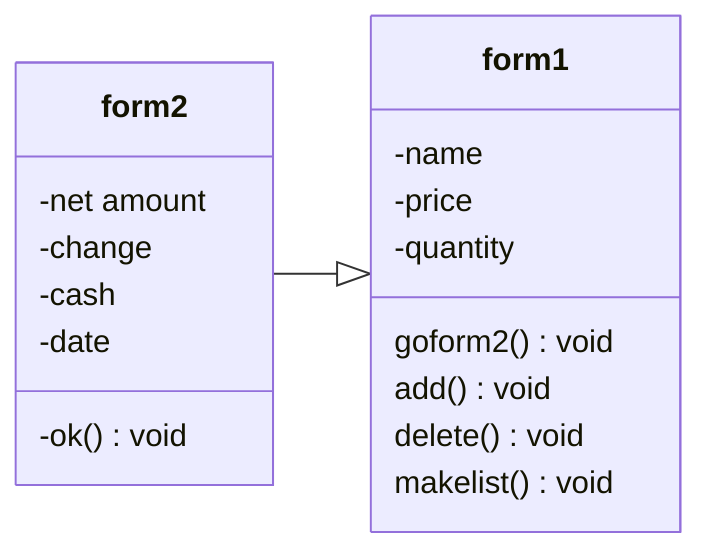

# project003_643450072-7
ความเป็นมาของโปรแกรม
```
เห็นว่ามีของหลายชนิดที่สามารถขายใด้จึงคิดโปรเเกรมที่สามารถเพิ่มได้อย่าอิสระ
```
วัตถุประสงค์ของโปรแกรม
```
อำนวยความสะดวกด้านการเพิ่มสินค้าเเละจัดการรายการที่ขายไปว่าขายไปได้เท่าไร

```
Class Diagram

เจ้าของโปรแกรม
```่่่่่นายณัฐกานต์ อินทรพานิชย์ 643450072-7```
